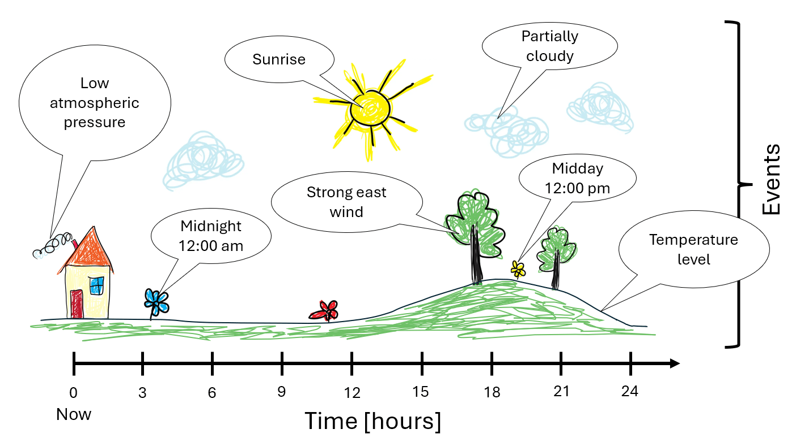
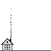
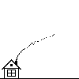
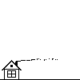
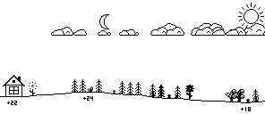
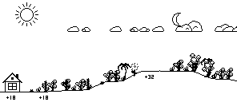
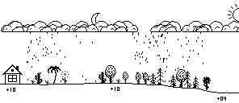
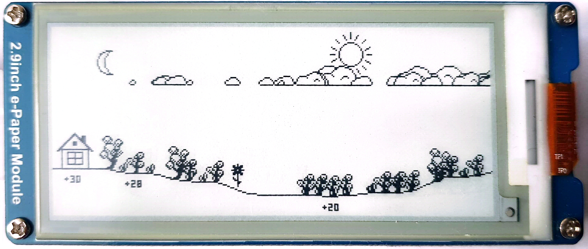
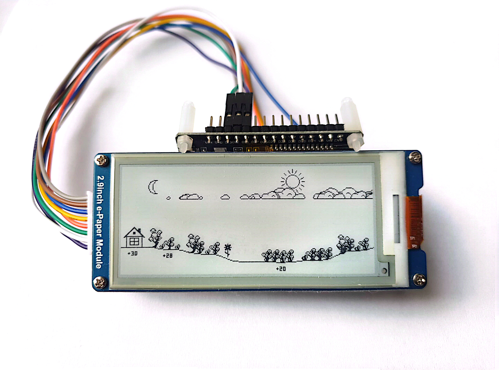

# Weather as Landscape
Visualizing Weather Forecasts Through Landscape Imagery


Traditional weather stations often display sensor readings as raw numerical data. Navigating these dashboards can be overwhelming and stressful, as it requires significant effort to locate, interpret, and visualize specific parameters effectively.

Viewing a landscape image feels natural to the human eye. The calming effect of observing landscape elements reduces stress and requires minimal effort, allowing for a more relaxed visual experience.

The method below demonstrates how to encode weather information within a landscape image, with no or minimal reliance on numerical data.


## Encoding principles

The landscape depicts a small house in the woods. The horizontal axis of the image represents a 24-hour timeline, starting from the current moment on the left, marked by the house, and extending to the conditions of the next day on the right. Various landscape elements distributed along the vertical axis symbolize weather events and conditions. The further an event is from the present, the farther it is positioned to the right in the image.





The following information can be encoded within the landscape image:

- Time markers to simplify timeline navigation:
  - Sunrise and sunset times
  - Noon and midnight
- Weather forecast information:
  - Wind direction and strength
  - Temperature fluctuations
  - Maximum and minimum temperature values
  - Cloud cover
  - Precipitation
- Current weather conditions:
  - Temperature
  - Atmospheric pressure
- Non weather events:
  - Birthdays
  - Holidays
  


## Implementation

The image generation code is written in [Python](https://www.python.org/) using the [Pillow](https://python-pillow.org/) library and is based on data from [OpenWeather](https://openweathermap.org/). The image is designed specifically for use on a 296x128 E-Ink display. The code tested on Python 3.9.


| Event image | Description |
|----------|------------|
|| Sunrise | 
|| Sunset |
|| Cloud cover |
|| Current time position|
|| Midnight |
|| Midday |
|| South wind |
|| East wind |
|| West wind |
|| North wind |
|| Rain|
|| Snow|
|| High atmospheric pressure (1050 hpa)|
|| Normal atmospheric pressure (1013 hpa) |
|| Low atmospheric pressure (980 hpa) |

The taller the trees, the stronger the wind is expected to be. A mix of different tree types in the forest indicates an intermediate wind direction.


## Examples

|&nbsp;Landscape&nbsp;image&nbsp;&nbsp;&nbsp;&nbsp;&nbsp;&nbsp;&nbsp;&nbsp;&nbsp;&nbsp;&nbsp;&nbsp;&nbsp;&nbsp;&nbsp;&nbsp;&nbsp;&nbsp;&nbsp;&nbsp;&nbsp;&nbsp;&nbsp;&nbsp;&nbsp;&nbsp;&nbsp;&nbsp;&nbsp;&nbsp;&nbsp;&nbsp;&nbsp;&nbsp;&nbsp;&nbsp;&nbsp;&nbsp;| Description |
|----------|------------|
|| It’s around noon, with clear skies and a few clouds expected. A moderate north wind will develop overnight. Temperatures are currently rising but will begin to fall after sunset, reaching their lowest point before sunrise. During this time, the wind is expected to shift to the northeast.|
|| The sun is rising and it will be a hot sunny day with a light southeast breeze. The temperature will remain high even after sunset, and the wind will shift to the east, becoming stronger throughout the evening.|
|| It will be cold and rainy throughout the day and night. The south wind will shift to the northeast overnight.|


## How the landscape changed during the day


## Running the code


#### Preparing environment Linux
```
./makevenv.sh
```
```
source .venv/bin/activate
```

#### Preparing environment Windows
```
makevenv.bat
```
```
.venv/Scripts/Activate
```

#### Image creation test

Update **OWM_KEY** variable in the `secrets.py` with your OpenWeather API key.

(optional) Change the coordinates in `secrets.py` to your location.

```
python run_test.py
```

#### Run server

```
python run_server.py
```


## Hardware

<!--  -->


The hardware setup includes an [ESP32 development board](https://www.adafruit.com/product/3269) and [2.9inch E-Ink display module](https://www.waveshare.com/2.9inch-e-paper-module.htm). Currently, the setup only displays an image sourced from the internet, updating every 15 minutes. It is uncertain whether the image generation code can be adapted for use with MicroPython on the ESP32 at this time.

[More information](esp32/README.md)
